# MTG Compare — User Manual

**MTG Compare finds the cheapest copy of any Magic: The Gathering card across
Japanese card shops and TCGPlayer, prices whole decklists, and keeps track of
what your collection is worth.**

Open it at **<https://mtg.vpablo.dev>**. It works on a phone and on a computer.
Every screenshot in this guide was taken on a phone. On a computer the pages
look the same, only wider.

The numbered red circles in the pictures match the numbered steps under them.

---

## Contents

1. [Sign in](#1-sign-in)
2. [Find the cheapest copy of a card](#2-find-the-cheapest-copy-of-a-card)
3. [Look for a specific version (full art, borderless, a set…)](#3-look-for-a-specific-version)
4. [Include shipping, choose shops](#4-include-shipping-choose-shops)
5. [Price a whole decklist](#5-price-a-whole-decklist)
6. [Your collection (Inventory)](#6-your-collection-inventory)
7. [What your collection is worth (Market)](#7-what-your-collection-is-worth-market)
8. [Tips and questions](#8-tips-and-questions)

---

## 1. Sign in

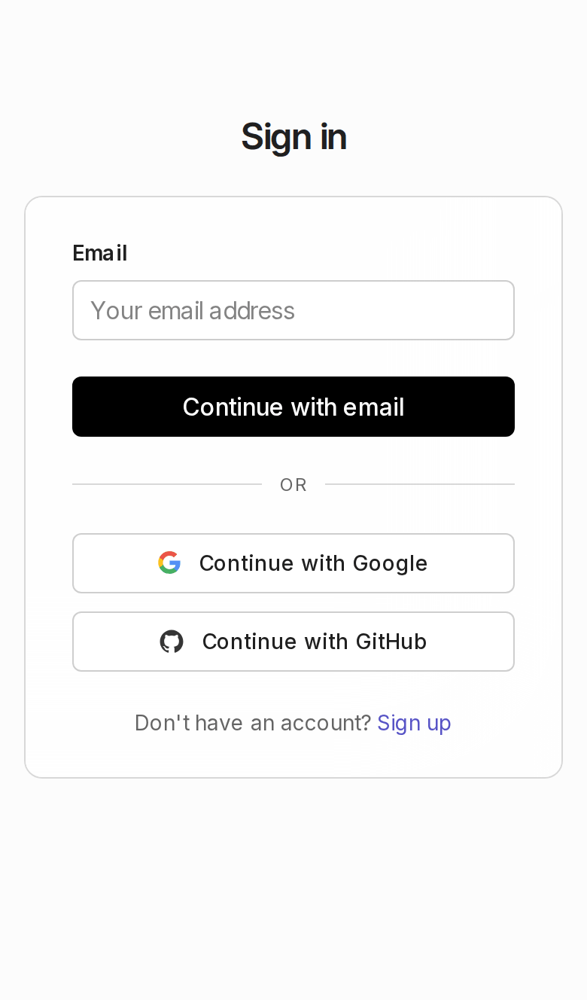

The first time you open the site you'll see this sign-in page.

- Use **Continue with Google** or **Continue with GitHub**, or type your
  email and press **Continue with email**.
- New here? Press **Sign up**. It's free.

You stay signed in on that device, so next time you go straight to the app.

> **Tip:** on a phone, add the page to your home screen (Safari: *Share →
> Add to Home Screen*; Chrome: *⋮ → Add to Home screen*) and it opens like an app.

The app has three tabs at the top: **Search**, **Inventory** and **Market**.

---

## 2. Find the cheapest copy of a card

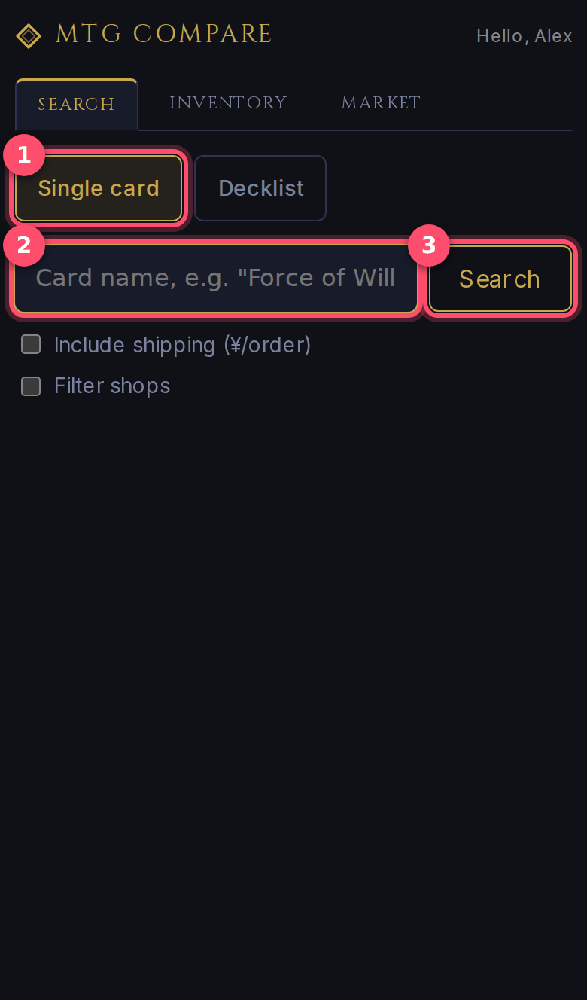

1. Make sure **Single card** is selected.
2. Type the card's name. Suggestions appear as you type; tap one to fill it in.
3. Press **Search**.

The app now asks every shop at the same time. The first search for a card can
take 10–20 seconds. After that, results for that card come back instantly for
the next 24 hours.

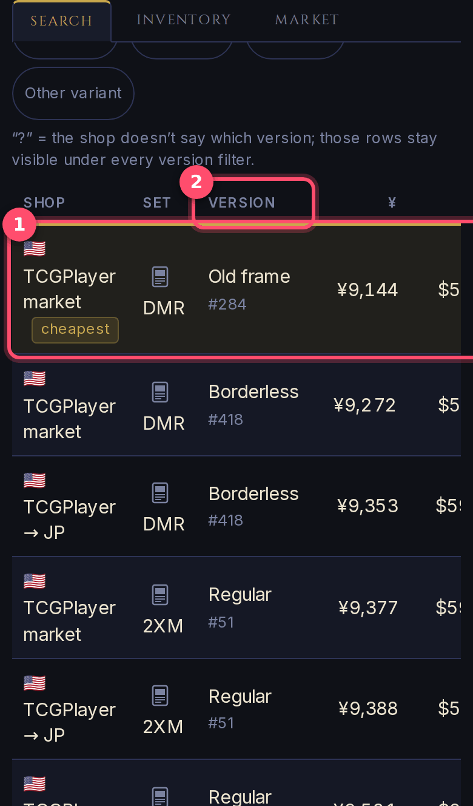

Every row is one copy you can buy. The list is sorted by price, cheapest first.

1. The top row has the **cheapest** badge. That's the best price.
2. **Version** tells you which printing it is: *Regular*, *Borderless*,
   *Old frame*, *Full art*… with the collector number underneath (`#418`).

Swipe the table sideways to see the rest of each row:

| Column | What it means |
|---|---|
| **Shop** | Where it's sold. 🇯🇵 = Japanese shop, 🇺🇸 = TCGPlayer (USA) |
| **Set** | The set code (e.g. `DMR` = Dominaria Remastered) |
| **¥ / $** | The price in yen and in dollars |
| **Stock** | How many copies the shop has (— when the shop doesn't say) |
| **Cond** | Condition. Japanese shops are always NM (near mint) |
| **Link** | **open** takes you to the shop's page to buy it |

Tap the small card icon next to the set to see the card itself:

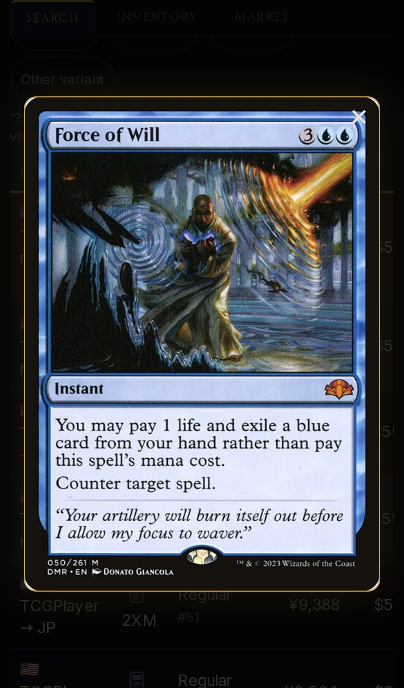

Tap **×** or anywhere outside the picture to close it.

---

## 3. Look for a specific version

Want the full-art one? The borderless one? A copy from one particular set?
You don't need to search differently: filter the results.

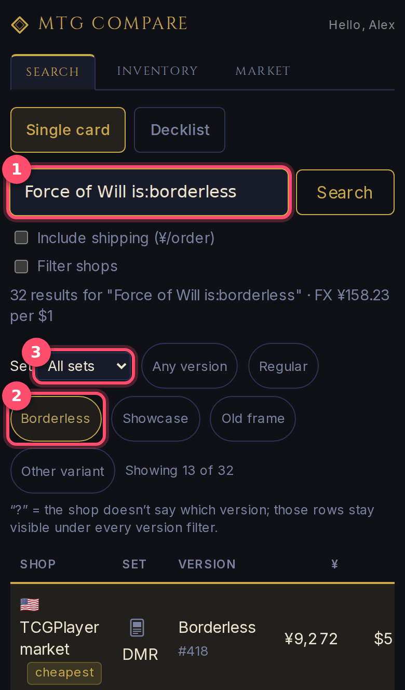

1. *(Optional shortcut)* add words to your search, e.g.
   `Force of Will is:borderless`. Those buttons are then already pressed for you.
2. Tap a **version button**: *Regular*, *Full art*, *Borderless*, *Showcase*,
   *Extended art*, *Old frame*. Tap it again (or *Any version*) to undo.
3. Pick a **Set** from the list to see only that set.

The text next to the buttons tells you how many copies are left
(*Showing 13 of 32*), and the **cheapest** badge moves to the cheapest copy
that's still showing.

**Search shortcuts.** Type them after the card name:

| Type this | To get |
|---|---|
| `set:DMR` | only the DMR set |
| `#418` | only collector number 418 |
| `is:fullart` `is:borderless` `is:showcase` `is:extended` `is:oldframe` | that version |
| `is:regular` | only the normal version |
| `Force of Will (DMR) 418` | the same thing, written like a decklist |
| `島/Island (全面アート)` | Japanese shop-style names work too |

> **What does "?" mean in the Version column?** That shop doesn't say which
> version it's selling. Those rows stay visible under every filter so you never
> miss a cheap copy. Open the shop's page to check.

---

## 4. Include shipping, choose shops

### Add shipping to the price

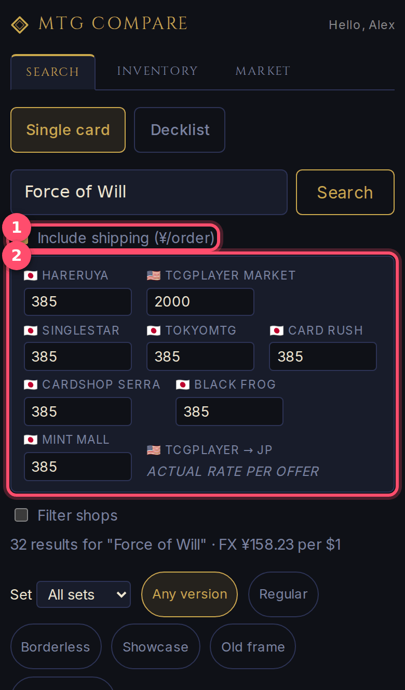

1. Tick **Include shipping**.
2. Each shop shows how much one order's shipping costs. ¥385 for Japanese
   shops and ¥2,000 for TCGPlayer are guesses; change them to what you
   actually pay. TCGPlayer → JP uses each seller's real shipping, so there's
   nothing to set.

Search again and the list is sorted by **price + shipping**, with a
**w/ship ¥** column. Your amounts apply to that search. Bookmark the results
page to keep them.

### Only search some shops

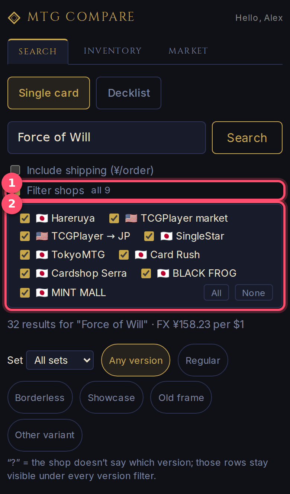

1. Tick **Filter shops**.
2. Untick the shops you don't want (or use **All** / **None**), then search.

The app remembers your choice on this device.

---

## 5. Price a whole decklist

Find the cheapest way to buy a whole list of cards, counting shipping and the
cards you already own.

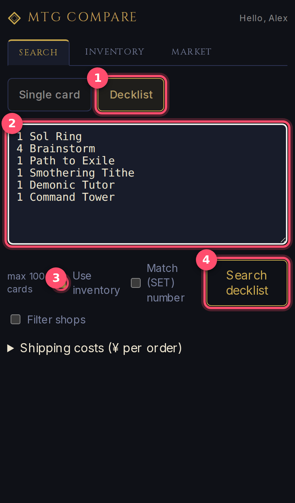

1. Tap **Decklist**.
2. Paste your list, one card per line: `4 Lightning Bolt`. Lists exported
   from Moxfield, Archidekt, MTG Arena and similar sites work as they are.
3. **Use inventory** (on by default) skips the copies you already have in
   your collection (see [Inventory](#6-your-collection-inventory)).
4. Press **Search decklist**.

Up to 100 cards per search. Basic lands are skipped automatically.

> Lists often include the set, like `1 Rhystic Study (C21) 79`. By default
> the app ignores that and finds the cheapest copy of *any* version. Tick
> **Match (SET) number** if you want exactly that printing.

Results appear card by card as they arrive:

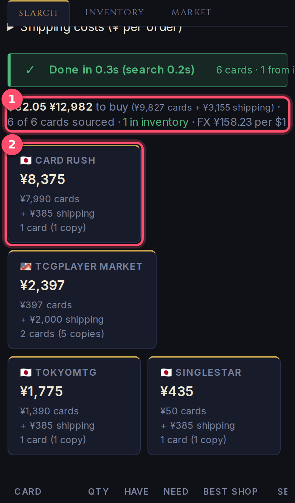

1. The total: how much it costs to buy everything you still need, cards plus
   shipping, and how many cards came from your inventory.
2. One box per shop: what to buy there, with that shop's shipping counted
   once.

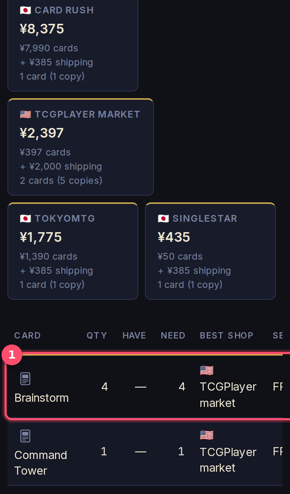

Below the boxes is one row per card:

1. The best shop for that card, how many you **need**, and the price.
   **open** goes straight to the shop.

Cards you already own show **✓ in inventory** instead of a price.

---

## 6. Your collection (Inventory)

Keep a list of the cards you own. This powers **Use inventory** in decklist
searches and the [Market](#7-what-your-collection-is-worth-market) values.

### Add one card

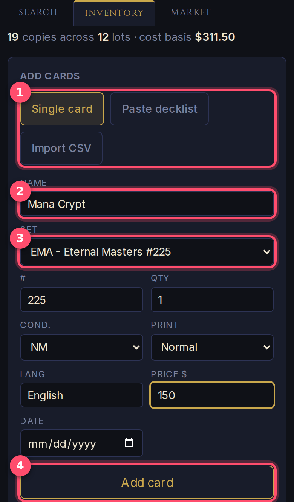

1. Choose how to add: **Single card**, **Paste decklist** or **Import CSV**.
2. Type the card name and pick it from the suggestions.
3. Pick the **Set**. The list shows every printing, and choosing one fills
   in the collector number (**#**) for you.
4. Set quantity, condition, foil or not (**Print**), language, and
   optionally what you paid (**Price $**) and when (**Date**). Then press
   **Add card**.

Adding what you paid lets the Market tab show your profit or loss.

### Add many cards at once

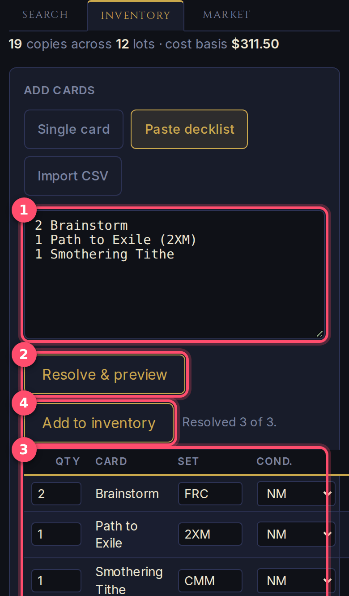

1. Paste a list (`2 Brainstorm`, `1 Path to Exile (2XM)`…).
2. Press **Resolve & preview**. The app looks every card up.
3. Check the preview: you can change quantity, set, condition and so on for
   each row before saving.
4. Press **Add to inventory**.

### Import a file

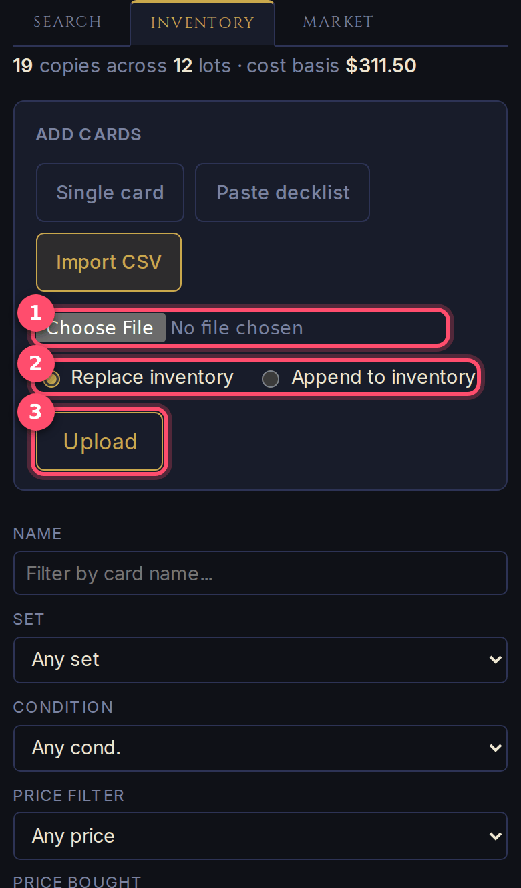

Already track your collection elsewhere? Export it as a CSV file from
Deckbox, CardCastle or a similar app, then:

1. **Choose File** and pick the CSV.
2. **Replace inventory** wipes your current list and loads the file.
   **Append** adds the file's cards to what's already there.
3. Press **Upload**.

### Find, export and delete

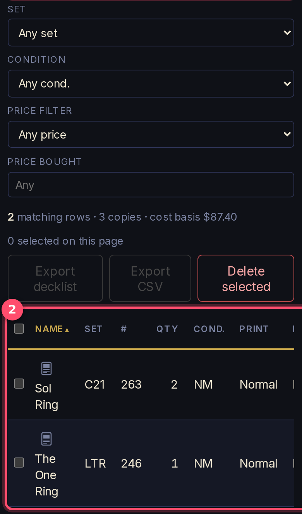

1. Narrow the list by **name**, **set**, **condition** or **price paid**.
   The counts and the cost total update as you type.
2. The list itself. Tap a column title to sort by it. Tick rows to
   **Export decklist**, **Export CSV** or **Delete selected**.

---

## 7. What your collection is worth (Market)

The Market tab values every card in your inventory at today's TCGPlayer
market price.

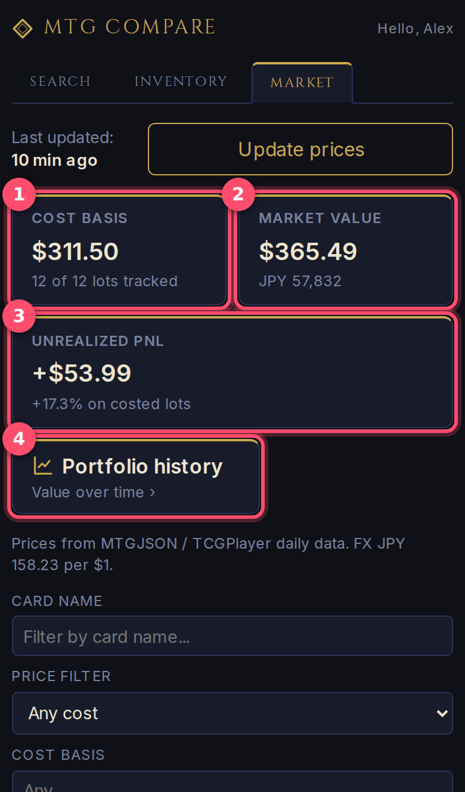

1. **Cost basis**: what you paid in total (for cards where you entered a price).
2. **Market value**: what the collection is worth today, in dollars and yen.
3. **Unrealized PnL**: profit or loss on paper. Green and *+* means it's worth
   more than you paid.
4. **Portfolio history**: how the whole collection's value has changed over time.

Prices update automatically once a day.

### One card's price over time

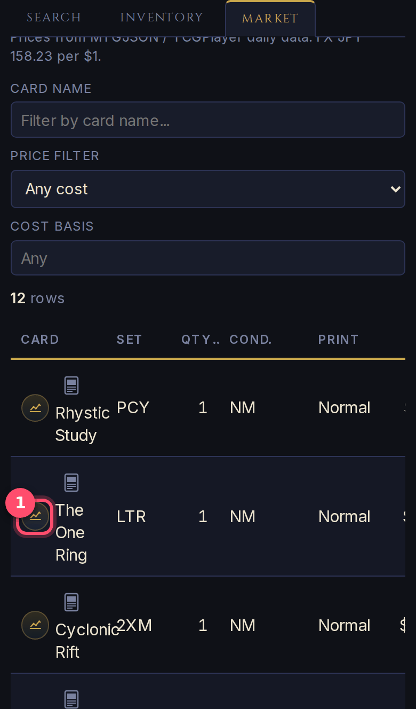

1. Below the summary there's one row per card. Tap the small **chart button**
   at the start of a row to see that card's price history.

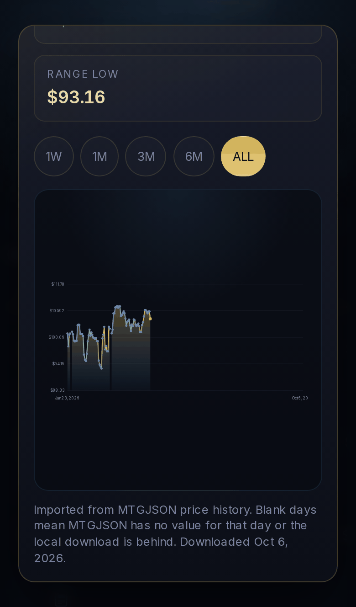

Pick a time range: **1W** (week), **1M**, **3M**, **6M** or **ALL**. The
boxes above the chart show the current price, the change over that range,
and the lowest price in it. Gaps in the line are days with no price data.

### The whole collection over time

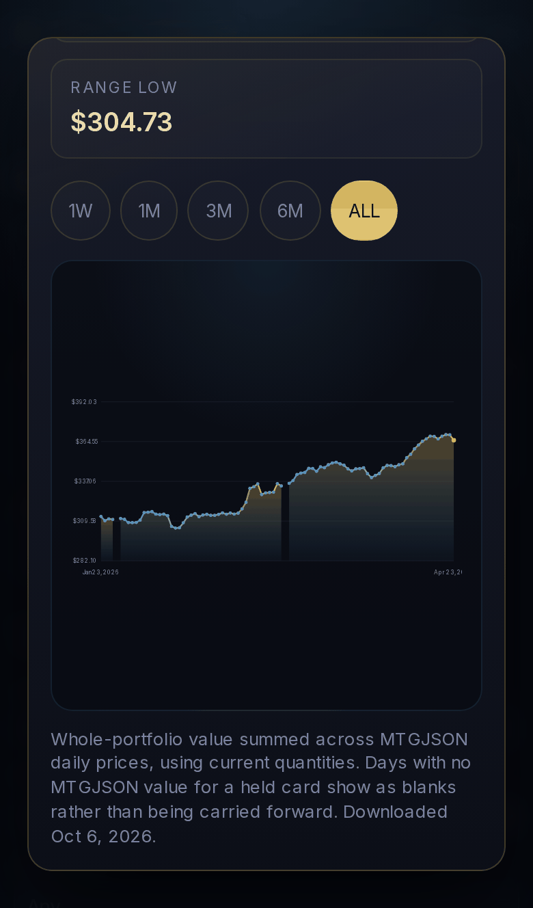

**Portfolio history** shows the same kind of chart for your whole collection:
today's cards, valued at each day's prices.

---

## 8. Tips and questions

**Why does the first search for a card take a while?**
The app asks nine shops live. Once a card has been searched, anyone searching
it in the next 24 hours gets the answer instantly.

**Are the prices for English cards?**
Yes. Japanese shops' prices are for **English, near-mint, non-foil** copies.
TCGPlayer → JP shows near-mint or lightly-played English copies that ship to
Japan.

**What's the difference between "TCGPlayer market" and "TCGPlayer → JP"?**
*TCGPlayer market* is the typical US price, a reference point, not a copy you
can buy from Japan. *TCGPlayer → JP* is the cheapest real offer from a seller
who ships to Japan, with that seller's shipping. To keep searches fast it only
checks the cheapest few printings of each card, so expensive versions (full
art and the like) may not show up there.

**Why is a version shown as "?"?**
The shop doesn't say which version it is. See
[section 3](#3-look-for-a-specific-version).

**Why are prices in both ¥ and $?**
Japanese shops price in yen and TCGPlayer in dollars. The app converts both
at the day's exchange rate (shown at the top of the results) so they can be
compared.

**A card I searched isn't found.**
Check the spelling: the name must be the card's real English name. Pick it
from the suggestions to be sure. Double-faced cards work with just the front
name (`Fable of the Mirror-Breaker`).

**Is my collection private?**
Other users can't see your inventory or your Market page. Each account only
ever sees its own collection.

### Running the app on your own computer

MTG Compare can also run as a desktop app (see the project README). It works
the same, with two differences:
- There's no sign-in.
- The Market tab has an **Update prices** button. The first time, press it to
  download price data (a large one-off download that takes a few minutes).
  After that, press it whenever you want fresh prices.
